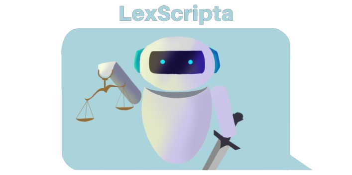

# ⚖️  LexScripta - Chatbot para Consultas Jurídicas

### 💻 Sobre o projeto
---

**[LexScripta](https://t.me/LexScripta_bot)** é uma solução avançada de inteligência artificial projetada para fornecer respostas rápidas, precisas e contextualizadas a consultas legais, com base em documentos jurídicos armazenados no Amazon S3.

Utilizando técnicas de **Recuperação Aumentada com Geração (RAG)**, sua arquitetura integra tecnologias como **Amazon Bedrock**, **Terraform** e bibliotecas como **Langchain** e **Chroma** para criar um fluxo robusto de importação, indexação e consulta de dados. Sua interface é implementada no **Telegram**, proporcionando uma experiência prática e acessível aos usuários.

### 🛠️ Funcionalidades
---

- **Processamento e Indexação**: Os conteúdos dos PDFs são convertidos em embeddings vetoriais utilizando o **Amazon Bedrock** e armazenados no **Chroma** para buscas rápidas e precisas.  
- **Integração com LangChain**: A lógica de consulta e recuperação utiliza fluxos de trabalho otimizados do **LangChain** para garantir respostas contextuais de alta qualidade.  
- **Consultas Jurídicas Baseadas em Contexto**: O chatbot utiliza a arquitetura RAG para recuperar trechos relevantes dos PDFs antes de gerar a resposta final, garantindo precisão nas informações fornecidas.

### 📦 Tecnologias
---

- Python 3.12.6
- AWS CLIv2 2.19.1
- Terraform 1.9.8

### 📚 Bibliotecas utilizadas
---

- boto3 1.13.73
- connstructs 10.4.2
- langchain 0.3.8
- langchain-aws 0.2.7
- langchain-community 0.3.8
- python-dotenv 1.0.1
- python-telegram-bot 21.7
- chromadb 0.5.21
- pypdf 5.1.0

### 📖 Exemplos de uso
---

- **Advogados**: Rapidamente consultar jurisprudências e leis em seus arquivos pessoais.  
- **Empresas**: Acessar políticas internas e regulamentos de forma ágil.  
- **Acadêmicos**: Pesquisar em bases de dados jurídicas com eficiência.

### 📁 Arquitetura de pastas
---
```shell
sprints-7-8-pb-aws-agosto-b/
├── chatbot
│   ├── source.bat
│   └── src
│       ├── services
│       │   ├── bot_backend.py
│       │   ├── bot_main.py
│       │   ├── chroma_db.py
│       │   ├── cloudwatch_logs.py
│       │   └── requirements.txt
│       └── terraform
│           ├── main.tf
│           ├── modules
│           │   ├── api-gateway
│           │   │   ├── main.tf
│           │   │   ├── outputs.tf
│           │   │   └── variables.tf
│           │   ├── ec2
│           │   │   ├── main.tf
│           │   │   ├── outputs.tf
│           │   │   ├── template_ec2
│           │   │   │   ├── main.tf
│           │   │   │   └── variables.tf
│           │   │   └── variables.tf
│           │   ├── s3
│           │   │   ├── main.tf
│           │   │   ├── outputs.tf
│           │   │   └── variables.tf
│           │   └── vpc
│           │       ├── main.tf
│           │       └── outputs.tf
│           ├── outputs.tf
│           ├── server-script.sh
│           └── variables.tf
└── dataset
```

### 📝 Como Utilizar o Sistema
---
Para realizar o deploy do bot, você precisa ter os seguintes programas instalados:
- Python
- AWS CLI
- Terraform

Com o requisitos instalados e o AWS CLI autenticado estamos prontos para começar.

No terminal, clone o repositório:
```shell
git clone -b grupo-2 https://github.com/Compass-pb-aws-2024-AGOSTO-B/sprints-7-8-pb-aws-agosto-b.git
```

Os documentos a serem analizados devem ser inseridos na pasta `dataset` na raiz do projeto e devem ser arquivos no formato `.pdf`.

Em seguida crie um arquivo `.env` dentro da pasta `chatbot/src/services/` contendo as variáveis necessárias:

```
BOT_TOKEN=
REGION_NAME=""
AWS_BUCKET_NAME=""
```

Para iniciar o deploy da infraestrutura do projeto com terraform, precisamos modificar algumas variáves no arquivo `terraform/variables.tf`:
- `profile`: o valor `default` deve ser o nome do perfil SSO autenticado no AWS CLI
- `bucket_name`: o valor `default` deve ser o nome do bucket que será criado na AWS, deve ser igual ao nome do bucket definido no arquivo `.env`.

Agora podemos inserir os seguintes comandos no terminal, separadamente, para iniciar o deploy com o Terraform
```shell
cd chatbot/src/terraform # Navegar até a pasta do Terraform

terraform init # Inicializa o projeto criante as State Files.

terraform apply # Inicia o deploy da aplicação e a criação dos recursos na AWS.
```

Durante o deploy é possível informar nomes para diversos recursos que serão criados, caso deseje. É importante que esses nomes sejam anotados, pois serão necessários para destrui-los através do Terraform.

Após a criação dos recursos, você deve se conectar a sua instância EC2. Isso pode ser feito pelo painel da AWS ou por SSH utilizando a chave `chatbot_key.pem` gerada.

Na instância, precisamos instalar as dependências do projeto:
```shell
cd services
pip install -r requirements.txt
```

Depois disso, é necessário colar as credênciais `Access Keys` que obtemos no portal de acesso da AWS no terminal para definir elas como variaveis ambiente.

Após terminar a configuração, podemos iniciar o bot:
```shell
python3 bot_main.py
```
Depois disso, o bot estará disponível para uso através do Telegram!

Atenção: a primeira execução criará os vetores e pode demorar alguns minutos.


### 🚨 Dificuldades encontradas
---

<table>
  <thead>
    <tr>
      <th>Desafios</th>
      <th>Solução</th>
    </tr>
  </thead>
  <tbody>
    <tr>
      <th>Carregamento de arquivos usando o PyPDFLoader</th>
      <th>Para a utilização da biblioteca PyPDFLoader houve problemas iniciais no uso da biblioteca, uma vez que a mesma não respondia de forma esperada, carregando diretamente os arquivos do bucket S3 através do cliente boto3. Para contornar essa dificuldade foi então utilizado o recurso de criação de uma pasta temporária que abriria tais arquivos PDF, faria sua leitura, transformaria seu conteúdo em objeto binário e então salvaria na pasta temporária para ser utilizado na sequência.</th>
    </tr>
    <tr>
      <th>Modularização e configuração do Terraform</th>
      <th>Dificuldade inicial devido ao aprendizado e assimilação da tecnologia. Para a criação do módulo EC2 houve dificulade na inserção das TAGS obrigatórias para rodar a instância, foi utilizado um recurso de template do aws no terraform, além disso, uma série de configurações dependentes e necessárias para a criação da instância precisaram serem criadas e atribuídas corretamente, são elas: security group, vpc, key pair, internet getway etc. Para a criação do bucket S3 houve dificuldade na localização e inserção dos arquivos presentes no dataset de forma a serem salvos dentro da bucket no momento da sua criação. Por fim, o entendimento da sintaxe da tecnologia, modularizada em arquivos main.tf, outputs.tf e variables.tf e como eles se correlacionam apresentou um grau de dificuldade considerável.</th>
    </tr>
    <tr>
      <th>Chroma DB</th>
      <th>A criação da lógica por trás da utilização do Chroma DB foi uma das dificuldades enfretadas, era preciso garantir que o conteúdo dos arquivos PDF do dataset seriam devidamente extraídos, convertidos em vetores e estivessem disponíveis para uso no momento da inicialização do bot, além disso, era preciso garantir que tais vetores conversariam de forma adequada com o modelo LLM do bedrock para aplicar a metodologia RAG de forma esperada.</th>
    </tr>
  </tbody>
</table>

### 💡 Futuro do projeto
---

<table>
  <thead>
    <tr>
      <th>Melhorias</th>
      <th>Implementação</th>
    </tr>
  </thead>
  <tbody>
    <tr>
      <th>Criação de memória</th>
      <th>Para otimizar as respostas, deixando-as mais assertivas e levando em consideração o contexto das mensagens trocadas entre usuário e bot, a criação de uma memória para armazenar e lidar com esses contextos de mensagens seria uma implementação de melhoria que aprimoraria o projeto.
</th>
    </tr>
    <tr>
      <th>Segurança da aplicação</th>
      <th>Um detalhamento e especificação de regras de segurança para os serviços AWS com o uso do terraform seria necessário para colocar a aplicação em produção.</th>
    </tr>
    <tr>
      <th>Fluxo de deploy da infraestrutura</th>
      <th>No momento os arquivos na pasta dataset são enviados ao S3 utilizando um comando do AWS CLI como recurso do Terraform. Como alternativa para o futuro, é recomendada a alteração para ferramentas como cloud-init ou Packer.</th>
    </tr>
  </tbody>
</table>


  ### 💻 Desenvolvido por
  ---

<table>
  <tbody>
    <tr>
      <td align="center" valign="top" width="14.28%"><a href="https://github.com/annedanielasv"><br /><sub><b>Anne Daniela</b></sub></a><br />
      <a href=https://www.linkedin.com/in/annedaniela/">
      
    </a>
      </td>
      <td align="center" valign="top" width="14.28%"><a href="https://github.com/LeoCeretta"><br /><sub><b>Leonardo Ceretta</b></sub></a><br />
      <a href="https://www.linkedin.com/in/leonardo-d-ceretta/">
      
    </a>
      </td>
      <td align="center" valign="top" width="14.28%"><a href="https://github.com/louisemorais"><br /><sub><b>Louise Morais</b></sub></a><br />
      <a href="https://www.linkedin.com/in/louise-morais-75533427a">
      
    </a>
      </td>
      <td align="center" valign="top" width="14.28%"><a href="https://github.com/munizeduardo"><br /><sub><b>Eduardo Muniz</b></sub></a><br />
      <a href="https://www.linkedin.com/in/munizeduardo1/">
      
    </a>
      </td>
    </tr>
  </tdbody>
</table>
